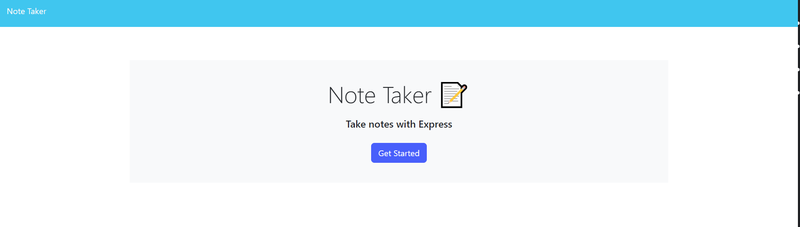

# NoteHub

## Description
NoteHub is a simple note-taking tool that allows the user to enter notes to schedule/plan their day and keep track of the notes accordingly.The app is accessible from any device thanks to the responsive design.  
## How it Works

- Hit the "Get Started" button to access the app
- From here you can click the plus symbol in the top right to create a new note
- Once you type in the title of the note and the text, a save icon will appear next to the plus sign so it can be saved.
- If you want to delete any note, you can click the red trash bin next to the note
- You can look at and edit notes by clicking them on the left side of the app

## Website Showcase

### <ins>[NoteHub](https://boiling-citadel-94619.herokuapp.com/)</ins>

 

